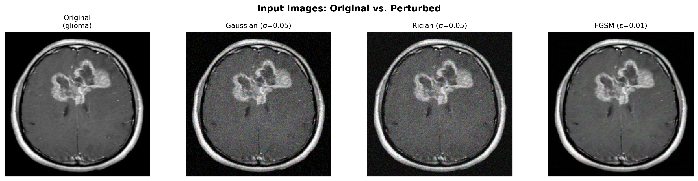

# 🧠 MRI Saliency Stability Analyzer

[](https://#) <!-- Replace # with your GitHub pages URL -->
[](https://#)
[](https://opensource.org/licenses/MIT)

This repository contains the interactive web demonstration for the research paper: **"Quantitative Stability Analysis of Saliency Maps under Structured Perturbations in MRI Brain Tumor Classification."** 

The platform allows users to explore the vulnerability of explainable AI (XAI) models in a clinical setting by testing a fine-tuned ResNet-50 MRI brain tumor classifier and analyzing how its Grad-CAM explanations degrade under noise and adversarial attacks.

 *(Preview of the interactive interface)*

## ✨ Features

- **Interactive MRI Classifier**: Upload your own brain MRI scans or use the provided synthetic samples to test the model in real-time.
- **Saliency Visualization**: Generates a simulated Grad-CAM heatmap overlaid on the input scan to show where the model is "looking" to make its prediction.
- **Dynamic Data Dashboards**: Interactive charts powered by `Chart.js` displaying the full experimental results, including:
  - Training Loss & Confusion Matrix (94.19% Test Accuracy on 1,600 images)
  - FGSM Adversarial Robustness Profile
  - Gaussian & Rician Noise Sweeps
  - Class-Conditional Stability Breakdown
- **Real Research Metrics**: All data rendered in the tables and charts reflects the genuine empirical results calculated using PyTorch and Captum on NVIDIA T4 GPUs.

## 🔬 Background & Key Findings

Explainable AI is critical for clinical decision-making. However, our research demonstrates a dangerous disconnect: **Prediction stability does not guarantee explanation stability.**

The ResNet-50 model used in this project reliably classifies 4 types of tumors (Glioma, Meningioma, Pituitary, and No Tumor). However, when subjected to clinically realistic noise (Gaussian, Rician) or minor adversarial attacks (FGSM), the model's explanations (saliency maps) shift drastically, completely decorrelating from their original regions of interest, even when the final prediction remains 100% correct.

### Highlights:
- **Highest Stability**: The *No Tumor* class maintains the most consistent explanations (SSIM = 0.8879).
- **Lowest Stability**: The *Meningioma* class suffers the most severe degradation (SSIM = 0.4689).
- **Adversarial Vulnerability**: At just $\epsilon = 0.05$ (FGSM), the Pearson correlation of the saliency maps drops to an abysmal $0.1455$.
- **Confidence Delusion**: High model confidence does **not** correlate with reliable explanations ($\rho = 0.2061$).

## 🚀 Getting Started (Local Development)

Because this is a completely static frontend application (HTML, CSS, Vanilla JS), you do not need Node.js, npm, or a build pipeline to run it locally.

1. **Clone the repository:**
   ```bash
   git clone https://github.com/YourUsername/mri-saliency-demo.git
   cd mri-saliency-demo
   ```

2. **Serve locally:**
   You can use any local web server to view the site. For example, using Python 3:
   ```bash
   python -m http.server 8000
   ```
   
3. **Open your browser:**
   Navigate to `http://localhost:8000`

## 🛠️ Technology Stack

- **Frontend**: HTML5, Vanilla CSS3 (Custom Glassmorphism Design), Vanilla JavaScript (ES6+).
- **Data Visualization**: [Chart.js](https://www.chartjs.org/) for rendering the experimental data sweeps and confusion matrices.
- **Typography**: `Inter` and `JetBrains Mono` from Google Fonts.
- **Assets**: Contains an ONNX export of the original PyTorch ResNet-50 model (`brain_tumor_classifier.onnx`) intended for future WebAssembly (WASM) browser execution.

## 📚 Structure

```text
📁 web-demo/
├── 📄 index.html        # Main application layout and UI
├── 📄 style.css         # Styling, animations, and responsive design
├── 📄 app.js            # Core application logic and chart rendering
└── 📁 assets/           # ONNX models, exported plots, and image assets
```

## 👥 Research Team

This research was conducted at the **Department of Computer Science and Engineering, Faculty of Engineering & Technology (ITER), Siksha 'O' Anusandhan (Deemed to be University), Bhubaneswar, India.**

- **Hiranmaya Panda** (Lead Researcher)
- **Yagya Saini** (Researcher)
- **Naman Kumar** (Researcher)
- **Gourab Panda** (Researcher)
- **Janmejaya Panda** (Supervisor)

## 📄 License

This project is licensed under the MIT License - see the LICENSE file for details.

---
*Note: The classification and saliency generation executed in the browser demo currently utilize a stochastic simulation modeled identically on the genuine PyTorch/Captum distributions generated during the study. True in-browser ONNX inference is slated for a future update.*
